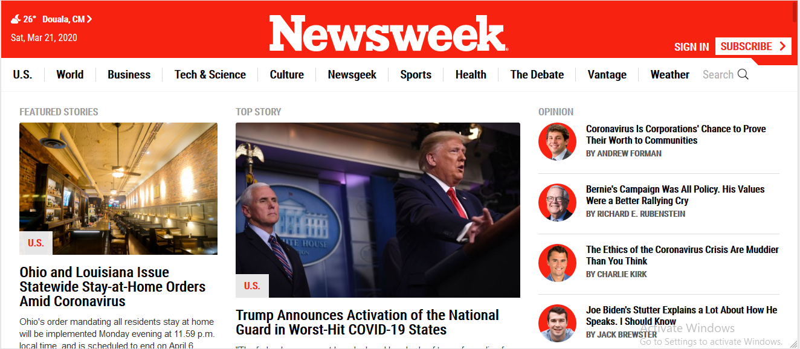
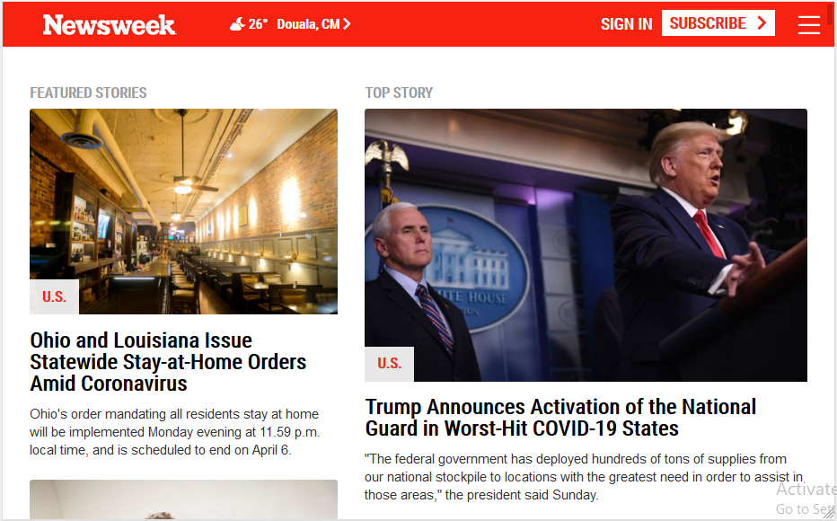

# Using Bootstrap

> The aim of this project was to make a colne of the **Newsweek.com** landing page using the Bootstrap Framework and making sure the responsiveness matches that of the original page. 

Screenshot of Page

> For this project I used the Bootstrap Grid system to achieve the requried responsiveness for the page. I also added my own personal styles (Media Queriess) to achieve certain design aspects that I could not achive with Bootstrap alone. Also I included my own personal styles too to replicate the design of the page (Colors, Hover-effects etc). For the first time too I use the CSS Grid system to achieve the first navbar layout and its resposivness which I must say I'm pretty proud of. It was a challenging Project, I'm just happy I was able to at least make it look as close to the original as possible.

## Built With

- Html
- Css
- Bootstrap

## Live Demo

[Live Demo Link](https://rawcdn.githack.com/OA7/Newsweek-clone/cf6284145ca762f50c1174951fb623271c30558e/index.html)

## Author

👤 **Osong Agberndifor**

- Github: [Osong Agberndifor](https://github.com/OA7)
- Twitter: [Osong Agberndifor](https://twitter.com/Osong17)
- Linkedin: [Osong Agberndifor](https://linkedin.com/osong-agberndifor)

## 🤝 Contributing

Contributions, issues and feature requests are welcome!

Feel free to check the [OA7 issues page](https://github.com/OA7/Newsweek-clone/issues).

## Show your support

Give a ⭐️ if you like this project!

